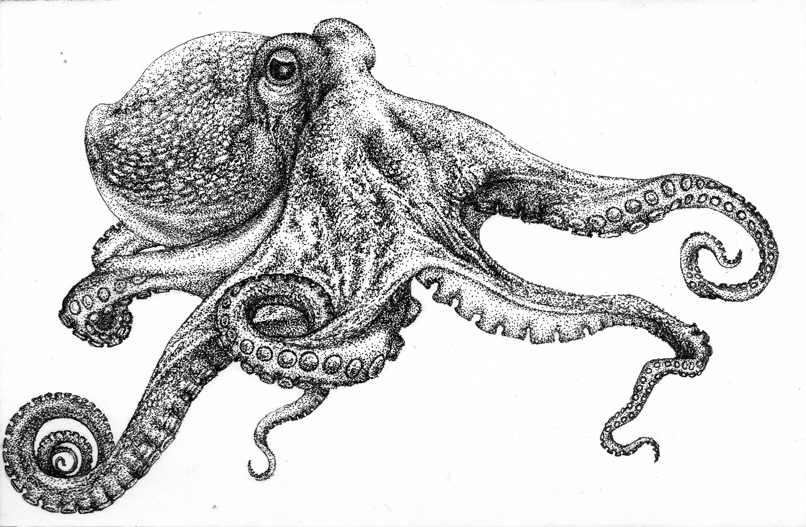
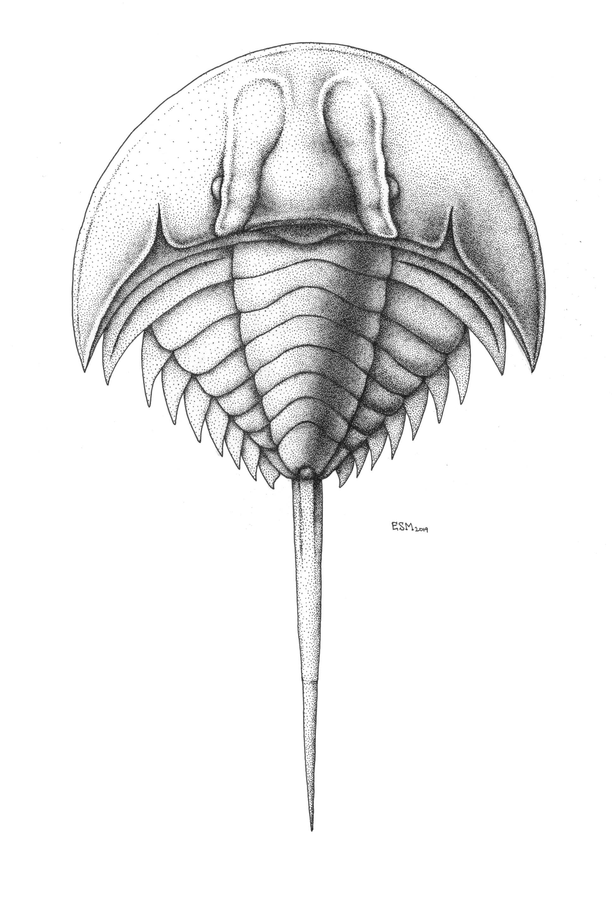
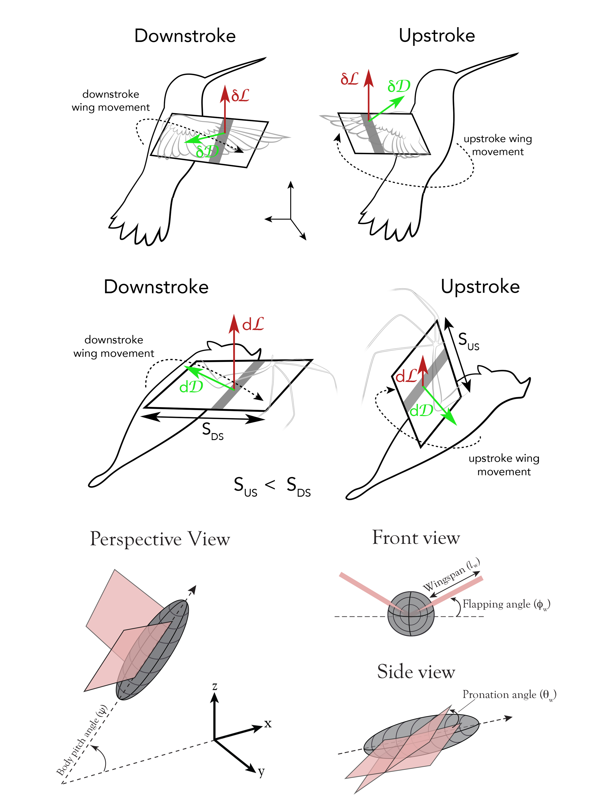
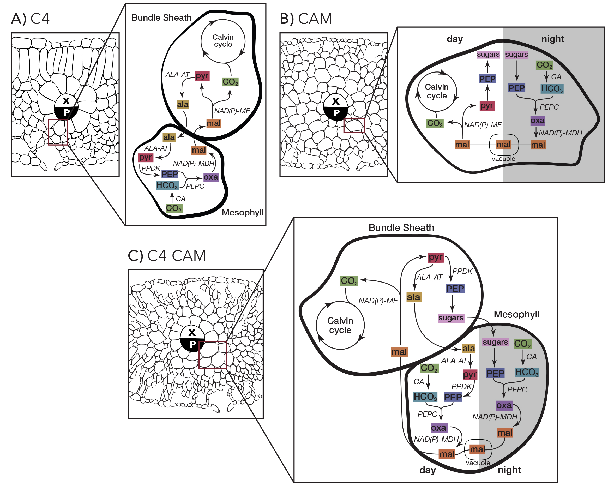

<link href="markdown_styles.css" rel="stylesheet"></link>

  

## Hi! My name is Elissa

---

I am a joint PhD student at E3B Columbia and the graduate studies program at NYBG. 
I'm interested in studying the evolution of morphological diversity in various strange and wonderful plant groups, including:

  <figcaption><i>Pedicularis</i></figcaption>
  
    <figcaption>Ferns</figcaption>
  
  <figcaption>and Lycophytes</figcaption>
   

---

## BC (Before Columbia)

I worked at the Yale Peabody Museum of Natural History, where my affinity for dead things served me well...

 

At YPM I managed digitization activities for the Western Interior Seaway NSF TCN Grant. The goal of the grant was to digitize and photograph all the fossil specimens from the Western Interior Seaway in YPM's collection.

 ~

Prior to working at YPM I earned my undergraduate degree from Brown University where I studied bat wing morphology in the [Aeromechanics and Evolutionary Morphology Lab](https://www.brown.edu/Departments/EEB/EML/). For my indepedent research I used histology to characterize the morphology of the trailing edge, but I also had the great pleasure of training bats to fly through tiny windows 

 
---

## Illustration

I'm  also a scientific illustrator and I love to nerd out about science  communication

  <figcaption>One of my favorite techniques is stippling</figcaption>
  
  
  
  

<figcaption>But my favorite medium has to be watercolor</figcaption>
  
  
  

  <figcaption>Unfortunately, I mostly get paid for digital work</figcaption>
  
  
  

*testing*...

  

  

    
    
    
    
    
    
    
  

  

    
    
    
    
    
    
  

